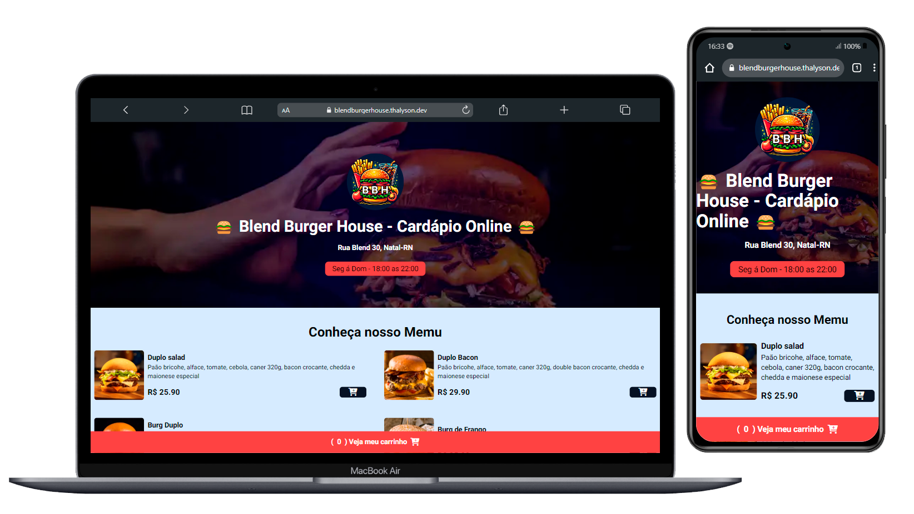

# 🍔 **Blend Burger House - Cardápio Online** 🍔

Bem-vindo ao **Blend Burger House**, onde a paixão por hambúrgueres artesanais se mistura aos melhores ingredientes e receitas criativas. No nosso site, você encontrará uma seleção especial de hambúrgueres preparados na hora, acompanhamentos crocantes e bebidas refrescantes, tudo pensado para proporcionar uma experiência única.




Acesse nosso site: [Blend Burger House](https://blendburgerhouse.thalyson.dev/)

## 📋 Funcionalidades

Nosso cardápio online oferece várias funcionalidades, permitindo uma navegação simples e intuitiva:

- [X] Exibição de cardápio dinâmico
- [X] Categorias (burgers, bebidas)

## 🔧 Instalação

Para rodar este projeto localmente, siga os passos abaixo:

1. Clone o repositório:
   ```
   git clone https://github.com/seu-usuario/blend-burger-house.git
   ```

2. Instale as dependências:
   ```
   npm install
   ```

3. Rode o projeto localmente:
   ```
   npm run dev
   ```

## 🛠️ Tecnologias & Libs

- HTML
- CSS
- JavaScript
- TailwindCSS

## 🚀 Próximos Passos

- [ ] Implementar tema light/dark
- [ ] Criar página de contato
- [ ] Atingir 75% de cobertura de testes
